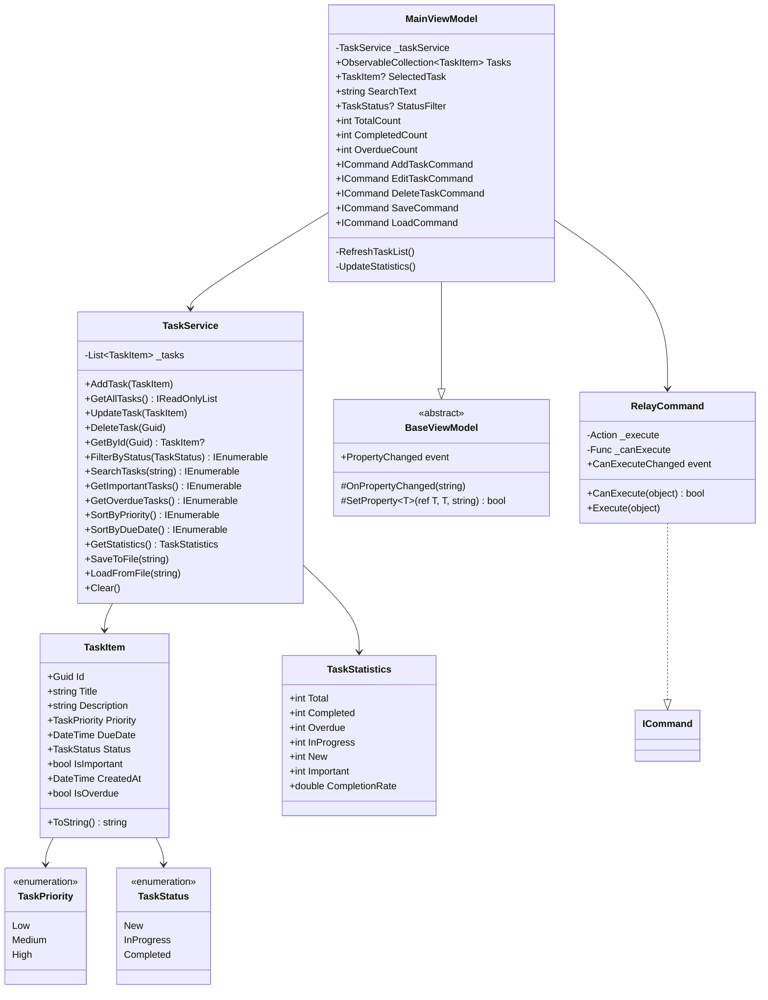

# ПОЯСНИТЕЛЬНАЯ ЗАПИСКА
## к учебному проекту «Менеджер задач» (TaskManager)

---

**Государственное образовательное учреждение**  
среднего профессионального образования  

**Специальность:** 09.02.07 «Информационные системы и программирование»  
**Дисциплина:** Летняя производственная практика  
**Курс:** 3  

**Тема:** Разработка приложения для управления задачами (Task Manager)  
на языке C# с использованием технологии WPF  

**Выполнил:** студент группы _______  
**Руководитель:** ________________________  

**Год:** 2025

---

## Оглавление

1. [Введение](#1-введение)
2. [Постановка задачи](#2-постановка-задачи)
3. [Архитектура проекта](#3-архитектура-проекта)
4. [Диаграмма классов](#4-диаграмма-классов)
5. [Описание модулей](#5-описание-модулей)
   - 5.1 [TaskManager.Core — бизнес-логика](#51-taskmanagercore--бизнес-логика)
   - 5.2 [TaskManager.WPF — пользовательский интерфейс](#52-taskmanagerwpf--пользовательский-интерфейс)
   - 5.3 [TaskManager.Tests — модульные тесты](#53-taskmanagertests--модульные-тесты)
6. [Описание пользовательского интерфейса](#6-описание-пользовательского-интерфейса)
7. [Ключевые фрагменты кода](#7-ключевые-фрагменты-кода)
8. [Тестирование](#8-тестирование)
9. [Инструкция по запуску](#9-инструкция-по-запуску)
10. [Заключение](#10-заключение)

---

## 1. Введение

В ходе летней производственной практики было разработано настольное приложение **TaskManager** — менеджер задач на платформе **.NET 8** с использованием технологии **WPF** (Windows Presentation Foundation).

Приложение позволяет пользователю создавать, редактировать, удалять и организовывать задачи. Поддерживаются приоритеты, статусы, сроки выполнения, пометка важности, сохранение в файл и загрузка из файла в формате JSON.

**Стек технологий:**

| Технология | Назначение |
|------------|-----------|
| C# 12 / .NET 8 | Основной язык и платформа |
| WPF | Пользовательский интерфейс |
| MVVM | Архитектурный паттерн |
| LINQ | Фильтрация, поиск, сортировка |
| System.Text.Json | Сериализация данных |
| xUnit | Модульное тестирование |
| Git | Система контроля версий |

---

## 2. Постановка задачи

**Цель проекта:** разработать приложение-менеджер задач, демонстрирующее:
- объектно-ориентированное программирование (классы, наследование, интерфейсы)
- архитектурный паттерн MVVM
- работу с коллекциями и LINQ
- привязку данных (Data Binding) в WPF
- сериализацию/десериализацию JSON
- модульное тестирование (xUnit)

**Функциональные требования:**

- Хранить список задач в оперативной памяти с возможностью сохранения в файл
- Поддерживать приоритеты (Низкий / Средний / Высокий)
- Поддерживать статусы (Новая / В работе / Завершена)
- Помечать задачи как «Важные»
- Выделять просроченные задачи визуально
- Искать задачи по названию и описанию
- Фильтровать по статусу
- Сортировать по приоритету и сроку
- Показывать статистику (всего, завершено, просрочено, % выполнения)
- Сохранять и загружать задачи в формате JSON

---

## 3. Архитектура проекта

Проект разделён на три отдельных модуля (проекта в Solution):

```
TaskManager.sln
├── TaskManager.Core        ← Бизнес-логика (без зависимостей)
├── TaskManager.WPF         ← UI, ссылается на Core
└── TaskManager.Tests       ← Тесты, ссылается на Core
```

Такое разделение называется **многоуровневой архитектурой** (n-tier). Бизнес-логика (`Core`) полностью независима от UI — её можно протестировать без запуска приложения.

Внутри WPF-проекта применяется паттерн **MVVM**:

```
┌─────────────────────────────────────────────────────┐
│  View (XAML)                                        │
│  MainWindow.xaml ─── DataBinding ───┐               │
│  TaskDialog.xaml                    ▼               │
└──────────────────────────────────────────────────── │
         ↑ Commands / Bindings                        │
┌─────────────────────────────────────────────────────┤
│  ViewModel                          │               │
│  MainViewModel.cs ──── вызывает ───►│               │
│  RelayCommand.cs                    │               │
│  BaseViewModel.cs (INotifyPropChng) │               │
└──────────────────────────────────────────────────── │
         ↑ методы сервиса                             │
┌─────────────────────────────────────────────────────┤
│  Model / Service (Core)                             │
│  TaskService.cs                                     │
│  TaskItem.cs                                        │
│  TaskStatistics.cs                                  │
└─────────────────────────────────────────────────────┘
```

**Преимущества MVVM:**
- View не содержит бизнес-логики — только разметку
- ViewModel не знает о конкретном View — легко тестировать
- Данные передаются через механизм привязки (Binding), а не вручную

---

## 4. Диаграмма классов



---

## 5. Описание модулей

### 5.1 TaskManager.Core — бизнес-логика

#### Перечисления (Enums/)

**TaskPriority** — приоритет задачи:
```csharp
public enum TaskPriority
{
    Low    = 0,  // Низкий
    Medium = 1,  // Средний
    High   = 2   // Высокий
}
```

**TaskStatus** — статус выполнения:
```csharp
public enum TaskStatus
{
    New        = 0,  // Новая
    InProgress = 1,  // В работе
    Completed  = 2   // Завершена
}
```

#### Модели (Models/)

**TaskItem** — основная модель данных. Содержит все поля задачи и вычисляемое свойство `IsOverdue` (просроченность):

```csharp
public bool IsOverdue => DueDate.Date < DateTime.Today
                         && Status != TaskStatus.Completed;
```

**TaskStatistics** — агрегированная статистика. Вычисляет процент выполнения:

```csharp
public double CompletionRate =>
    Total > 0 ? Math.Round((double)Completed / Total * 100, 1) : 0;
```

#### Сервис (Services/)

**TaskService** — главный класс бизнес-логики. Хранит задачи в `List<TaskItem>` и предоставляет методы:

- **CRUD:** `AddTask`, `GetAllTasks`, `UpdateTask`, `DeleteTask`, `GetById`
- **Поиск/фильтрация:** `SearchTasks`, `FilterByStatus`, `GetImportantTasks`, `GetOverdueTasks`
- **Сортировка:** `SortByPriority`, `SortByDueDate`
- **Статистика:** `GetStatistics`
- **Персистентность:** `SaveToFile`, `LoadFromFile`

---

### 5.2 TaskManager.WPF — пользовательский интерфейс

#### BaseViewModel

Базовый класс с реализацией `INotifyPropertyChanged`. Метод `SetProperty` автоматически уведомляет UI при изменении значения:

```csharp
protected bool SetProperty<T>(ref T field, T value,
    [CallerMemberName] string? propertyName = null)
{
    if (EqualityComparer<T>.Default.Equals(field, value)) return false;
    field = value;
    OnPropertyChanged(propertyName);
    return true;
}
```

#### RelayCommand

Универсальная команда, связывающая кнопки XAML с методами ViewModel:

```csharp
public RelayCommand(Action<object?> execute, Func<object?, bool>? canExecute = null)
```

#### MainViewModel

Связывает бизнес-логику с интерфейсом. Ключевой метод `RefreshTaskList` применяет фильтрацию, поиск и сортировку через LINQ, затем обновляет `ObservableCollection<TaskItem>`.

#### Value Converters

Конвертеры преобразуют данные для визуального отображения в DataGrid:

| Конвертер | Входное значение | Выходное значение |
|-----------|-----------------|-------------------|
| `PriorityToTextConverter` | `TaskPriority.High` | `"Высокий"` |
| `PriorityToBrushConverter` | `TaskPriority.High` | Красный `SolidColorBrush` |
| `StatusToTextConverter` | `TaskStatus.InProgress` | `"В работе"` |
| `StatusToBrushConverter` | `TaskStatus.Completed` | Зелёный `SolidColorBrush` |
| `BoolToStarConverter` | `true` | `"★"` |
| `BoolToVisibilityConverter` | `true` | `Visibility.Visible` |

---

### 5.3 TaskManager.Tests — модульные тесты

Тесты написаны на **xUnit** — современном фреймворке для .NET. Каждый тест проверяет один конкретный сценарий. Всего написано **25 тестов**, охватывающих:

| Категория | Кол-во тестов |
|-----------|:-------------:|
| Добавление задач | 5 |
| Удаление задач | 3 |
| Обновление задач | 2 |
| Поиск | 5 |
| Фильтрация | 2 |
| Сортировка | 2 |
| Статистика | 5 |
| Сохранение/загрузка JSON | 6 |
| Просроченность | 3 |

---

## 6. Описание пользовательского интерфейса

Главное окно приложения состоит из четырёх зон:

### Зона 1 — Заголовок
Тёмно-синяя панель с названием приложения и кнопками «Сохранить» / «Загрузить».

### Зона 2 — Панель управления
Содержит:
- **Поле поиска** — фильтрует задачи по мере ввода (привязка `UpdateSourceTrigger=PropertyChanged`)
- **ComboBox «Статус»** — фильтрует по выбранному статусу
- **Кнопки сортировки** — «По приоритету», «По сроку», «✖ Сбросить»
- **Кнопки CRUD** — «Добавить», «Изменить», «Удалить»

### Зона 3 — DataGrid задач
Таблица с колонками:

| Колонка | Описание |
|---------|----------|
| ★ | Звёздочка для важных задач |
| Название | Жирным шрифтом |
| Описание | Растягивается на всю доступную ширину |
| Приоритет | Цветной бейдж: 🔴 Высокий / 🟡 Средний / 🟢 Низкий |
| Срок | Дата в формате ДД.ММ.ГГГГ |
| Статус | Цветной бейдж: серый/синий/зелёный |
| ! | Иконка ⚠ для просроченных задач |

**Цветовое выделение строк:**
- 🟡 Жёлтый фон — важные задачи (`IsImportant = true`)
- 🔴 Розовый фон — просроченные задачи (`IsOverdue = true`)

### Зона 4 — Статистика
Тёмная нижняя панель с пятью счётчиками: Всего / Завершено / Просрочено / Важных / % выполнения.

### Диалог задачи
При добавлении и редактировании открывается модальный диалог с полями:
- Название (обязательное)
- Описание (многострочное)
- Приоритет (ComboBox)
- Статус (ComboBox)
- Срок (DatePicker)
- Важная (CheckBox)

---

## 7. Ключевые фрагменты кода

### Поиск через LINQ

```csharp
public IEnumerable<TaskItem> SearchTasks(string query)
{
    if (string.IsNullOrWhiteSpace(query))
        return _tasks.AsReadOnly();

    string lowerQuery = query.ToLowerInvariant();

    return _tasks.Where(t =>
        t.Title.ToLowerInvariant().Contains(lowerQuery) ||
        t.Description.ToLowerInvariant().Contains(lowerQuery));
}
```

### Комплексная фильтрация в ViewModel

```csharp
private void RefreshTaskList()
{
    IEnumerable<TaskItem> result = _taskService.GetAllTasks();

    if (StatusFilter.HasValue)
        result = result.Where(t => t.Status == StatusFilter.Value);

    if (!string.IsNullOrWhiteSpace(SearchText))
    {
        string q = SearchText.ToLowerInvariant();
        result = result.Where(t =>
            t.Title.ToLowerInvariant().Contains(q) ||
            t.Description.ToLowerInvariant().Contains(q));
    }

    result = SortMode switch
    {
        "Priority" => result.OrderByDescending(t => t.Priority),
        "DueDate"  => result.OrderBy(t => t.DueDate),
        _          => result.OrderByDescending(t => t.CreatedAt)
    };

    Tasks = new ObservableCollection<TaskItem>(result);
    UpdateStatistics();
}
```

### Сохранение в JSON

```csharp
public void SaveToFile(string path)
{
    string json = JsonSerializer.Serialize(_tasks, new JsonSerializerOptions
    {
        WriteIndented = true,
        Converters = { new JsonStringEnumConverter() }
    });
    File.WriteAllText(path, json);
}
```

### Команды MVVM (RelayCommand)

```csharp
// В конструкторе MainViewModel:
AddTaskCommand    = new RelayCommand(_ => AddTask());
EditTaskCommand   = new RelayCommand(_ => EditTask(), _ => SelectedTask != null);
DeleteTaskCommand = new RelayCommand(_ => DeleteTask(), _ => SelectedTask != null);
```

### Привязка в XAML

```xml
<!-- Поле поиска с мгновенной реакцией на ввод -->
<TextBox Text="{Binding SearchText, UpdateSourceTrigger=PropertyChanged}"/>

<!-- Кнопка активна только при выбранной задаче -->
<Button Content="Удалить" Command="{Binding DeleteTaskCommand}"/>

<!-- DataGrid с автоматическим обновлением -->
<DataGrid ItemsSource="{Binding Tasks}" SelectedItem="{Binding SelectedTask}"/>
```

---

## 8. Тестирование

### Запуск тестов

```bash
dotnet test TaskManager.Tests/TaskManager.Tests.csproj --verbosity normal
```

### Пример теста

```csharp
[Fact(DisplayName = "LoadFromFile восстанавливает ранее сохранённые задачи")]
public void LoadFromFile_RestoresTasks()
{
    var original = new TaskService();
    original.AddTask(new TaskItem
    {
        Title    = "Тестовая задача",
        Priority = TaskPriority.High,
        Status   = TaskStatus.InProgress
    });

    string path = Path.GetTempFileName();
    original.SaveToFile(path);

    var loaded = new TaskService();
    loaded.LoadFromFile(path);

    var tasks = loaded.GetAllTasks();
    Assert.Single(tasks);
    Assert.Equal("Тестовая задача", tasks[0].Title);
    Assert.Equal(TaskPriority.High, tasks[0].Priority);

    File.Delete(path); // Убираем временный файл
}
```

### Структура тестов

Каждый тест следует шаблону **AAA** (Arrange → Act → Assert):

```
Arrange — подготовить данные и сервис
Act     — вызвать тестируемый метод
Assert  — проверить результат
```

---

## 9. Инструкция по запуску

1. Убедиться, что установлен **.NET 8 SDK** и **Visual Studio 2022** с компонентом *.NET desktop development*
2. Открыть файл `TaskManager.sln` в Visual Studio
3. Выбрать конфигурацию **Debug** и платформу **Any CPU**
4. В Solution Explorer щёлкнуть ПКМ на `TaskManager.WPF` → **Set as Startup Project**
5. Нажать **F5** для запуска

**Для запуска тестов:**
- Меню: **Test → Run All Tests** (горячая клавиша `Ctrl+R, A`)
- Результаты отобразятся в окне **Test Explorer**

---

## 10. Заключение

В ходе практики были закреплены и применены на практике следующие навыки:

- Проектирование **многоуровневой архитектуры** приложения
- Реализация паттерна **MVVM** на WPF
- Работа с **LINQ** (фильтрация, сортировка, агрегация)
- **Привязка данных** в WPF (`Binding`, `INotifyPropertyChanged`, `ICommand`)
- **Сериализация/десериализация** объектов в JSON
- Написание **модульных тестов** (xUnit, 25 тестов)
- Работа с системой **Git** (коммиты, `.gitignore`)
- Оформление **технической документации**

Приложение полностью работоспособно и соответствует требованиям технического задания.
